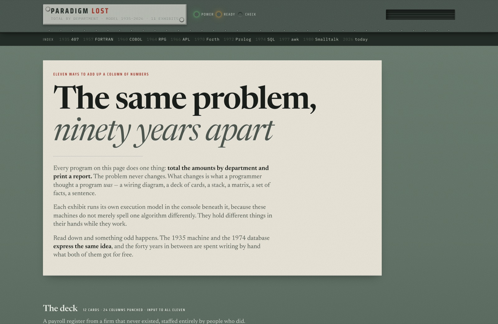
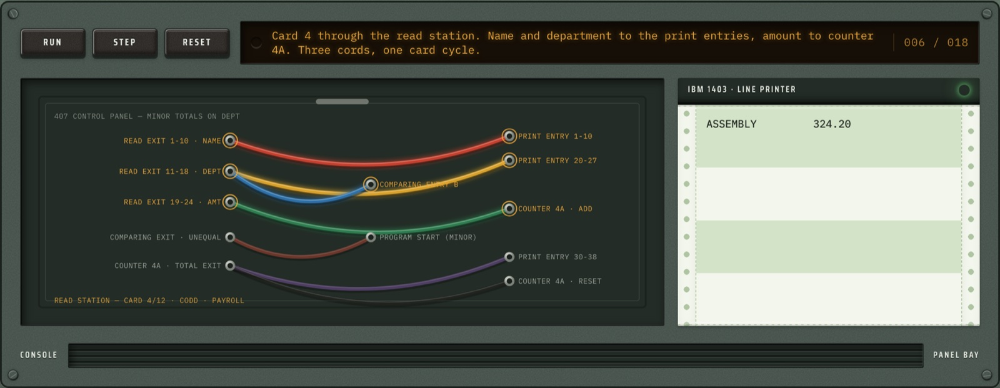
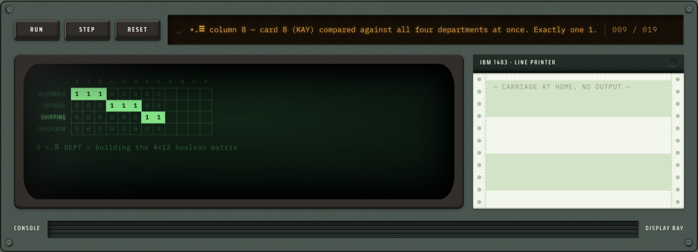
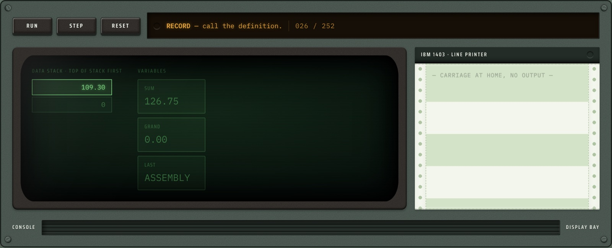
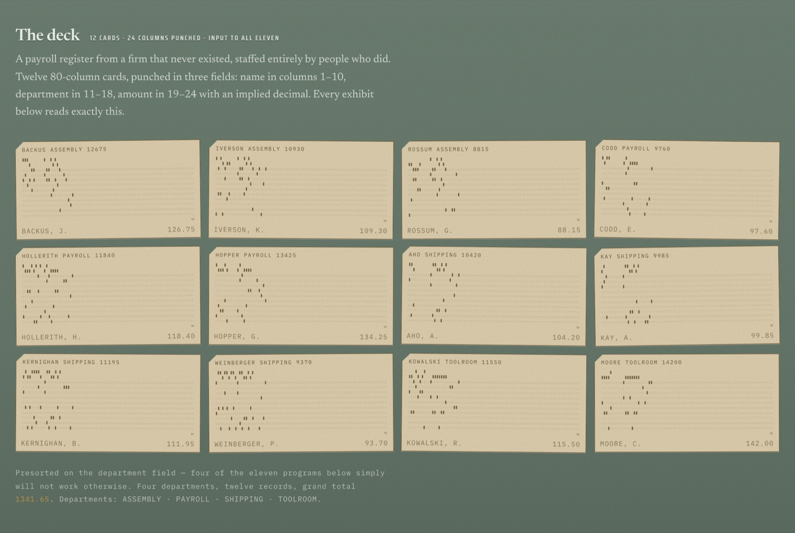
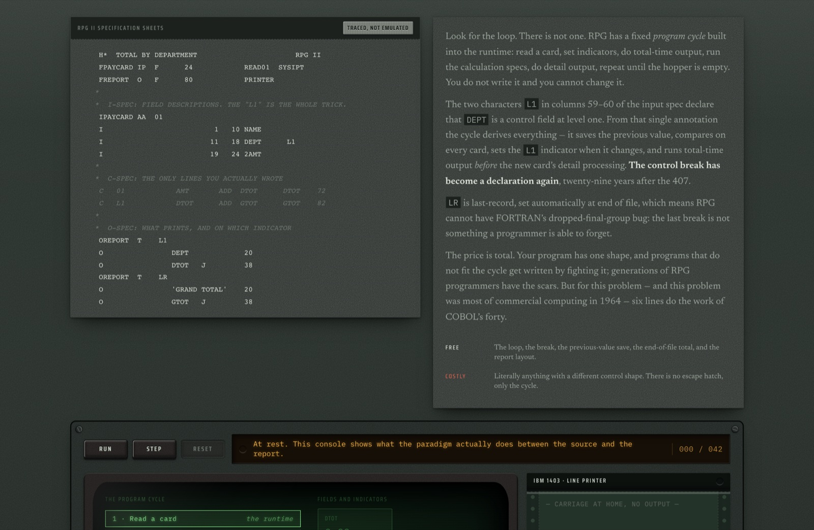

<div align="center">

# Paradigm Lost

**One problem — *total the amounts by department and print a report* — solved eleven ways between 1935 and 2026, with the execution model of each one shown working.**

[](https://github.com/oddurs/paradigm-lost/actions/workflows/ci.yml)
[](https://github.com/oddurs/paradigm-lost/actions/workflows/deploy.yml)
[](LICENSE)

**[Read it →](https://oddurs.github.io/paradigm-lost)**

</div>



## The argument

The usual story is a ladder: machine code, then assembly, then procedures, then
objects, then at long last the declarative styles, each rung an improvement on
the last. Read this page from the top and that story falls apart.

We **started** declarative. We had to — the earliest machines were not machines
you instructed, they were machines you *configured*, and a configuration has no
time in it. Then the stored-program computer arrived and made everything
possible, which meant it made nothing easy, and for forty years the price of
generality was that you wrote the loop, the comparison, the accumulator and the
reset yourself, on every job, forever.

Put exhibit 1 next to exhibit 8 and they are the same four thoughts:

| 1935 · wired | | 1974 · named |
| --- | :---: | --- |
| 082 sorter pass | ≡ | `ORDER BY dept` |
| compare DEPT ≠ DEPT | ≡ | `GROUP BY dept` |
| counter 4A total exit | ≡ | `SUM(amount)` |
| counter 4A reset | ≡ | *(so implied the language has no word for it)* |

## It is not a syntax comparison

Anyone can put eleven listings side by side. The point here is that these
machines do not merely spell one algorithm differently — **they hold different
things in their hands while they work**, and each exhibit animates the thing its
paradigm actually holds.

### 1935 · An IBM 407 control panel

There is no source listing, because there is no source. The behaviour of the
machine *is* the set of cords in the panel. Watch the comparing exit fire on a
change of department and start a minor program step.



### 1966 · APL, where the grouping is a matrix

`(U ∘.≡ DEPT) +.× AMT` — the outer product builds a 4×12 boolean membership
matrix, and the inner product totals it. Grouping and summing turn out to be the
same operation as linear algebra. The matrix builds a column at a time, and no
amount has been added to anything until it is complete.



### 1970 · Forth, which genuinely executes

`engines/forth.ts` is a small token-threaded interpreter: it compiles each colon
definition to a flat instruction array with resolved branch targets and advances
one instruction per step, so the data stack can be watched filling and draining a
word at a time.



### The input to all eleven

Twelve 80-column cards, punched with real Hollerith zone/digit encoding — the
holes say what the cards say. The staff are the people whose paradigms appear in
the exhibits.



### Both themes



## The eleven

| Year | Paradigm | What it claims a program is |
| ---: | --- | --- |
| 1935 | IBM 407 plugboard | A shape you wire into a panel |
| 1957 | FORTRAN II | A sequence of statements with numbers on them |
| 1960 | COBOL | A description of records, then sentences about them |
| 1964 | RPG II | Specifications; the machine supplies the control flow |
| 1966 | APL | An expression; control structure dissolves into data |
| 1970 | Forth | A vocabulary you grow down toward the problem |
| 1972 | Prolog | A set of true statements you ask questions of |
| 1974 | SQL | A description of the answer |
| 1977 | awk | Rules: when you see this, do that |
| 1980 | Smalltalk-80 | A live world of objects you talk to |
| 2026 | pandas | One line, and nothing to see |

## Running it

```bash
npm install
npm run dev        # http://localhost:1401   (the port is the IBM 1401)
npm run check      # typecheck + build + verify
```

`npm run build` emits a static export to `out/`.

## Stack

- **Next.js 16** — App Router, Turbopack, static export
- **StyleX 0.19** via [`@stylexswc/nextjs-plugin`](https://github.com/Dwlad90/stylex-swc-plugin)
  (Rust/SWC) with `@stylexswc/postcss-plugin` for extraction. The official StyleX
  Next plugin is pinned at 0.11 and needs Babel, which disables Turbopack;
  Turbopack in turn cannot run webpack plugins, so CSS extraction has to live in
  PostCSS.
- No CSS framework and no component library. Tokens and primitives only.

## The design system

`design/` holds three token files. Anything ending `.stylex.ts` defines CSS
custom properties; light and dark values sit side by side on every token, so the
theme switches on `prefers-color-scheme` with no runtime and no flash.

| File | Exports |
| --- | --- |
| `tokens.stylex.ts` | `color` (materials), `depth` (bevels), `texture` (surface grain) |
| `type.stylex.ts` | `font`, `size`, `leading`, `tracking`, `weight`, `optical` |
| `space.stylex.ts` | `space`, `radius`, `border`, `measure`, `motion` |

Four rules hold the look together:

1. **Materials encode meaning, and never cross over.** Paper is what a human
   wrote. Machine green is the machine. Phosphor on glass is the machine's own
   view of its state. Greenbar is what it printed. The plugboard is a physical
   panel, so it is not rendered on a CRT.
2. **One light source, upper-left.** Every `depth` token assumes it.
3. **Three type voices that never trade jobs.** Newsreader — one serif at two
   optical sizes, since it carries an `opsz` axis — for prose; Saira Condensed,
   uppercase and letterspaced, only ever for lettering stamped on a machine
   plate; IBM Plex Mono for anything the machine said.
4. **Small radii.** Pressed steel and phenolic mouldings have a tool radius of a
   millimetre or two.

The palette is a machine room rather than a colour wheel: the grey-green enamel
every manufacturer used on cabinets between roughly 1955 and 1975, bond paper,
fanfold greenbar, manila card stock, bakelite, brushed steel, brass, phosphor.
Every colour is a thing you could have touched.

Nothing on the page is a flat fill. `texture` tokens carry the sandblasted
finish on the enamel, the fibre in the paper, the directional grain in brushed
steel, the louvres in a grille, the rivet pitch along a seam, the specular sheen
on the face of a tube, and the crease across a sheet of fanfold. The page is
built as *panels* rather than one surface: each exhibit is bolted to the one
above it with a riveted seam, and the room light falls off as you go down the
cabinet.

## Layout

```
app/            layout, page, resets, the @stylex directive, the OG card
design/         tokens
components/
  primitives/   Panel, Sheet, PushButton, Screw, Rivet, Seam, Lamp,
                Plate, DataPlate, Vent, Rule, Badge, Layout
  views/        one per execution model — Plugboard, plus six CRT views
  Masthead, Hero, DeckSection, PunchCard, Listing, Printout,
  MachineStrip (the only client component), Exhibit, Essay
data/           the deck, the eleven exhibits, the step traces
engines/        a real token-threaded Forth
scripts/        verification
```

## Honesty about what runs

The **Forth exhibit genuinely executes**. The other ten **replay a hand-built
trace** of period-accurate source. Every listing carries a badge saying which it
is, and the colophon repeats it. Nothing claims to be an emulator that is not one.

That badge is enforced rather than promised: `npm run verify` drives the Forth
console to the end and diffs its printed report against the known totals, so the
interpreter cannot quietly regress into a lie. The same script asserts the
document never scrolls sideways at 320–1440px, which has caught two real bugs
(`1fr` grid tracks resolving to `minmax(auto, 1fr)`, and `white-space: nowrap` on
inline code).

Both run in CI on every push.

## Accuracy, and corrections

Sources are listed in the page colophon: the IBM 407 and 650 manuals of
operation, the RPG II reference, Backus 1957, Iverson 1962, Codd 1970,
Chamberlin and Boyce 1974, Aho/Weinberger/Kernighan 1978, Goldberg and Robson
1983.

**Corrections are the most valuable thing this repo can receive**, especially
from anyone who ran the real machines — there is
[an issue template](.github/ISSUE_TEMPLATE/correction.yml) for exactly that.
Period detail matters more here than almost anything else, because the page is
only worth reading if it is right.

## License

MIT — see [LICENSE](LICENSE).
